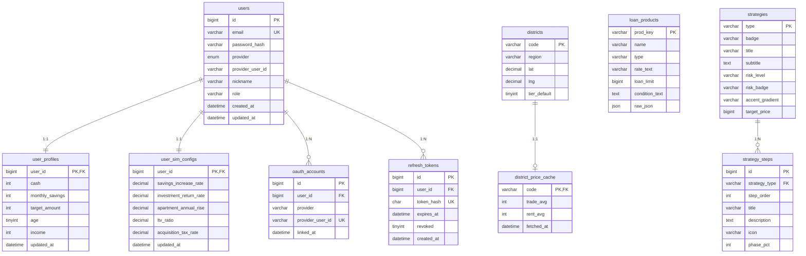

# InSeoul DB 데이터 모델

## ERD (Mermaid)



---

## 테이블 상세

### users
| 컬럼 | 타입 | 제약 | 설명 |
|---|---|---|---|
| id | BIGINT | PK AI | |
| email | VARCHAR(120) | UNIQUE NOT NULL | |
| password_hash | VARCHAR(100) | NULL | OAuth 전용 계정은 NULL |
| provider | ENUM | NOT NULL DEFAULT 'local' | local / kakao / google |
| provider_user_id | VARCHAR(100) | NULL | OAuth 공급자의 사용자 ID |
| nickname | VARCHAR(40) | NOT NULL | |
| role | VARCHAR(20) | NOT NULL DEFAULT 'USER' | USER / ADMIN |
| created_at | DATETIME | NOT NULL | |
| updated_at | DATETIME | NOT NULL ON UPDATE | |

**인덱스**: `uq_email`, `uq_provider_user(provider, provider_user_id)`

---

### user_profiles (1:1 → users)
| 컬럼 | 타입 | 설명 |
|---|---|---|
| user_id | BIGINT PK FK | |
| cash | INT | 보유 현금 (만원) |
| monthly_savings | INT | 월 저축액 (만원) |
| target_amount | INT | 목표 자산 (만원) |
| age | TINYINT UNSIGNED | |
| income | INT | 월 소득 (만원) |

---

### user_sim_configs (1:1 → users)
| 컬럼 | 타입 | 기본값 | 설명 |
|---|---|---|---|
| user_id | BIGINT PK FK | | |
| savings_increase_rate | DECIMAL(5,2) | 5.00 | 연 저축 증가율 (%) |
| investment_return_rate | DECIMAL(5,2) | 8.00 | 투자 수익률 (%) |
| apartment_annual_rise | DECIMAL(5,2) | 3.00 | 아파트 연간 상승률 (%) |
| ltv_ratio | DECIMAL(4,3) | 0.500 | LTV 비율 |
| acquisition_tax_rate | DECIMAL(5,4) | 0.0350 | 취득세율 |

---

### districts (정적 시드 — 서울 25개구)
| 컬럼 | 타입 | 설명 |
|---|---|---|
| code | VARCHAR(5) PK | LAWD_CD 법정동코드 (예: 11680) |
| region | VARCHAR(40) | 자치구명 (예: 강남구) |
| lat | DECIMAL(10,7) | 위도 |
| lng | DECIMAL(10,7) | 경도 |
| tier_default | TINYINT | 1=진입가능 / 2=3년내 / 3=장기목표 |

---

### district_price_cache (24h TTL)
| 컬럼 | 타입 | 설명 |
|---|---|---|
| code | VARCHAR(5) PK FK | districts.code |
| trade_avg | INT NULL | 매매 평균가 (만원) |
| rent_avg | INT NULL | 전세 평균가 (만원) |
| fetched_at | DATETIME | 마지막 갱신 시각 |

**갱신 정책**: `/api/districts/prices` 호출 시 24h 초과면 lazy refresh + `@Scheduled` 새벽 04:00 전체 갱신

---

### loan_products (정적 시드)
| prod_key | name | rate_text | loan_limit (만원) |
|---|---|---|---|
| bogeumjari | 보금자리론 | 3.65~4.00% | 36,000 |
| didimdul | 디딤돌 대출 | 2.45~3.55% | 25,000 |
| butimok_youth | 청년전용 버팀목 | 1.5~2.1% | 7,000 |

---

### strategies + strategy_steps (정적 시드)
| type | title | target_price (만원) | risk_level |
|---|---|---|---|
| relay | 징검다리 전략 | 35,000 | 낮음 |
| downsize | 소형 전략 | 55,000 | 중간 |

---

## MyBatis Mapper 위치

```
src/main/resources/mappers/
├── auth/
│   ├── UserMapper.xml          -- users, oauth_accounts, refresh_tokens
├── user/
│   ├── UserProfileMapper.xml   -- user_profiles
│   └── SimConfigMapper.xml     -- user_sim_configs
├── district/
│   ├── DistrictMapper.xml
│   └── DistrictPriceCacheMapper.xml
├── loan/
│   └── LoanProductMapper.xml
└── strategy/
    ├── StrategyMapper.xml
    └── StrategyStepMapper.xml
```
